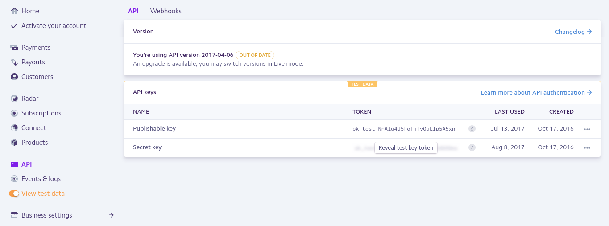
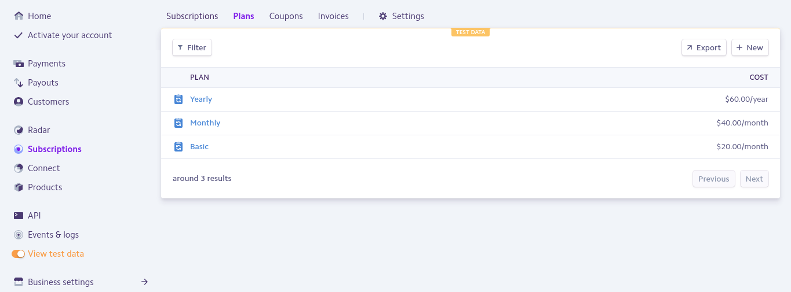

## Laravel-Stripe with Social and Email Authentication
<a href="https://packagist.org/packages/laravel/framework"></a>

Aplication that allows for users to subscribe with Stripe and Social Authentication.

## Documentation
   - [Laravel 5.3](https://laravel.com/docs/5.3)
   - [Laravel Cashier](https://laravel.com/docs/5.3/billing)
   - [Stripe](https://stripe.com/docs)  
   
## Setup

```bash
~ composer update
~ php artisan migrate
```

1) Stripe API Keys: Provide your Publishable Key and Secret Key.
   
```bash
    .env File:
    
    STRIPE_KEY=
    STRIPE_SECRET=
```
1.1) Stripe Example:


2) Manage your Plans (Test Data):


3) Social Authentication:

```bash
    .env File:
    
    FB_ID=
    FB_SECRET=
    FB_REDIRECT=
    
    STRIPE_KEY=
    STRIPE_SECRET=
    
    TW_ID=
    TW_SECRET=
    TW_REDIRECT=
    
    GOOGLE_ID=
    GOOGLE_SECRET=
    GOOGLE_REDIRECT=
    
    GITHUB_ID=
    GITHUB_SECRET=
    GITHUB_REDIRECT=
    
```
4) Confirm Email:
```bash
    .env File:
    
    ACTIVATION=true
```


